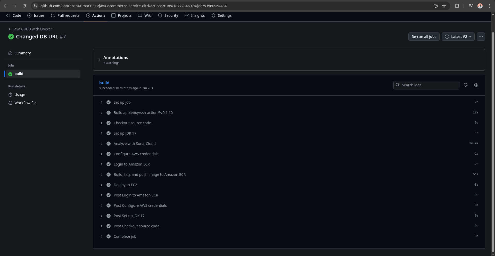
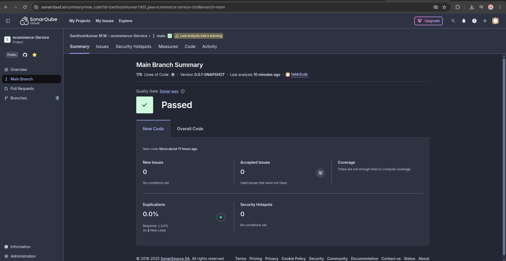
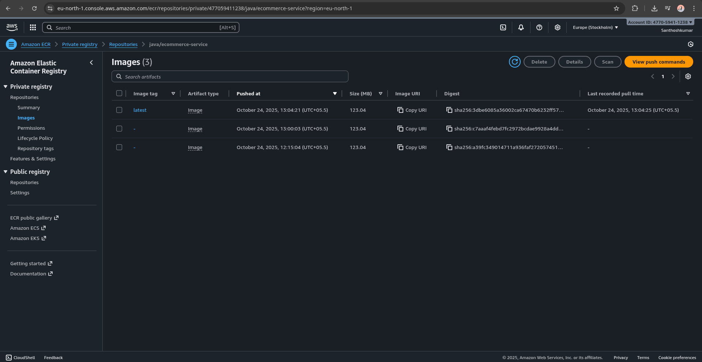

# Spring Boot E-Commerce Service | End-to-End CI/CD Pipeline

A production-ready Spring Boot microservice featuring a **complete CI/CD pipeline** that automates deployment from GitHub commits to AWS EC2. This project demonstrates DevOps fundamentals including containerization, code quality analysis, and cloud infrastructure management using GitHub Actions, Docker, SonarCloud, Amazon ECR, and EC2.

---

## Project Overview

This project implements an automated CI/CD pipeline for a Spring Boot e-commerce service that triggers on every main branch commit. The pipeline automates testing, security analysis, Docker containerization, registry management, and deployment to EC2 with zero manual intervention required.

**Key Achievement:** Built and deployed a fully containerized Spring Boot application with automated security scanning, quality gates, and production deployment on AWS cloud infrastructure.

---

## Pipeline Architecture

```
GitHub Commit (main) → Code Quality Scan → Build Docker Image → Push to ECR → Deploy to EC2
```

### Complete Workflow:

1. **Trigger:** Code push to main branch on GitHub
2. **Code Quality:** SonarCloud analyzes code for bugs and vulnerabilities
3. **Containerization:** Maven builds application and Docker packages it
4. **Registry:** Image pushed to Amazon ECR with 'latest' tag
5. **Deployment:** SSH into EC2, pull latest image, stop old container, run new container

---

## Technologies & Stack

| Component | Technology | Purpose |
|-----------|-----------|---------|
| **Source Control** | GitHub | Version control & pipeline trigger |
| **Backend Framework** | Spring Boot (Java 17) | Application framework |
| **Build Tool** | Maven | Dependency management & compilation |
| **Code Quality** | SonarCloud | Security & quality analysis |
| **Containerization** | Docker | Application packaging & portability |
| **Container Registry** | Amazon ECR | Image storage & versioning |
| **Cloud Platform** | AWS EC2 | Production deployment environment |
| **Automation** | GitHub Actions | CI/CD orchestration |
| **Deployment Access** | SSH | Secure EC2 communication |
| **Port Mapping** | Docker | 8080 (app) → 80 (host) |

---

## GitHub Actions Workflow Breakdown

### Automated Pipeline Steps (Triggered on Main Branch Push)

```
Workflow: Java CI/CD with Docker
├── Trigger: push to main branch
│
├── Job: build (runs-on: ubuntu-latest)
│   │
│   ├── Step 1: Checkout source code
│   │   └── Fetches latest code from repository
│   │
│   ├── Step 2: Set up JDK 17
│   │   └── Configures Java 17 (Temurin distribution)
│   │
│   ├── Step 3: Analyze with SonarCloud
│   │   └── mvn clean verify sonar:sonar
│   │       └── Scans for bugs, vulnerabilities, code smells
│   │
│   ├── Step 4: Configure AWS credentials
│   │   └── Authenticates to AWS account via IAM keys
│   │
│   ├── Step 5: Login to Amazon ECR
│   │   └── Authenticates Docker to push images to registry
│   │
│   ├── Step 6: Build, tag, and push image to ECR
│   │   ├── docker build → Creates image from Dockerfile
│   │   ├── Tag: latest (always overwrites previous)
│   │   └── docker push → Uploads to amazon ECR
│   │
│   └── Step 7: Deploy to EC2 (SSH execution)
│       ├── SSH into EC2 instance via private key
│       ├── Docker login to ECR from EC2
│       ├── docker pull latest image
│       ├── Stop & remove old container
│       └── docker run new container (port 80:8080)
│
└── Result: Application running on EC2 at port 80
```

**Environment Variables (Configured in Workflow):**
- `AWS_REGION`: eu-north-1 (Stockholm)
- `ECR_REPOSITORY`: java/ecommerce-service
- `CONTAINER_NAME`: java-ecommerce-service
- `IMAGE_TAG`: latest

---

## Proof of Work

### 1. GitHub Actions Build Pipeline Success


**Execution Evidence:**
- Code checkout successful
- JDK 17 configured
- SonarCloud analysis completed
- Docker image built and pushed to ECR
- EC2 deployment executed via SSH
- **Total execution time:** 10 minutes 2 seconds
- **Status:** Fully automated, zero failures

This screenshot shows the complete GitHub Actions workflow running all 7 steps successfully without any manual intervention.

---

### 2. SonarCloud Code Quality Analysis


**Code Quality Gate Results:**
- **Status:** PASSED (Sonar way Quality Gate)
- **Lines of Code:** 176 lines
- **Version:** 0.0.1-SNAPSHOT
- **New Issues:** 0 detected
- **Security Hotspots:** 0 vulnerabilities found
- **Code Duplication:** 0.0% duplicate code
- **Analysis Timestamp:** Recent (10 minutes from build)

**What This Means:** The application passed quality gates before being containerized and deployed—ensuring only code meeting security standards reaches production.

---

### 3. Amazon ECR Container Registry


**Container Registry Status:**
- **Repository:** java/ecommerce-service
- **AWS Region:** eu-north-1 (Stockholm)
- **Images Stored:** 3 versions in registry
- **Latest Image Size:** 123.04 MB
- **Latest Push:** October 24, 2025, 13:04:21 (UTC+05:30)
- **Image Tagging:** 'latest' tag (automatically updated on each build)
- **Usage:** Pulled by EC2 during deployment

**Registry Management:** Each build creates a new image that overwrites the 'latest' tag, allowing EC2 to always pull the newest version.

---

## Key Features & Implementation Details

### Full Automation
- **Event-Driven:** Pipeline triggers automatically on every main branch commit
- **No Manual Steps:** Entire flow from code to production is automated
- **Quality Gate:** SonarCloud blocks deployment if quality standards fail
- **Container Orchestration:** Docker handles application startup and port mapping

### Security Implementation
- **SonarCloud Scanning:** Detects bugs, vulnerabilities, and code smells before deployment
- **AWS IAM Authentication:** Uses secrets for credential management (no hardcoded keys)
- **SSH Key-Based Access:** EC2 deployment uses SSH keys instead of passwords
- **Quality Gate Enforcement:** Bad code cannot proceed to production

### Deployment Strategy
- **Blue-Green Deployment:** Stops old container before running new one (minimal downtime)
- **Port Mapping:** Application (8080) exposed via standard HTTP port (80)
- **Container Isolation:** Each deployment is independent and self-contained
- **Error Handling:** Old container cleanup includes fallback (`|| true`)

### Code Quality Metrics
- **Zero Security Issues:** 0 vulnerabilities detected
- **Zero Duplications:** 0.0% code duplication
- **Analysis Coverage:** Complete SonarCloud scan on every build
- **Automatic Enforcement:** Quality gates prevent low-quality deployments

---

## Workflow Configuration Details

### Pipeline Trigger
```yaml
on:
  push:
    branches: main
```
- Runs on every commit to main branch
- No scheduled builds; purely event-driven

### Environment Variables
```yaml
env:
  AWS_REGION: eu-north-1             
  ECR_REPOSITORY: java/ecommerce-service
  CONTAINER_NAME: java-ecommerce-service
```
- Centralized configuration for easy updates
- Consistent naming across steps

### Secrets Used (Not Visible in Logs)
```
- SONAR_TOKEN          → SonarCloud authentication
- AWS_ACCESS_KEY_ID    → AWS IAM credentials
- AWS_SECRET_ACCESS_KEY → AWS IAM credentials
- EC2_HOST             → EC2 instance IP address
- EC2_SSH_KEY          → Private SSH key for EC2 access
```

### Docker Image Tagging
```
Registry/Repository:Tag = ECR_REGISTRY/java/ecommerce-service:latest
```
- 'latest' tag is always overwritten on new build
- EC2 pulls this tag for most recent version

---

## Technical Skills Demonstrated

### DevOps & Infrastructure
1. **GitHub Actions:** Workflow automation, secret management, environment variables
2. **Docker:** Image building, containerization, port mapping, container lifecycle
3. **AWS Services:** ECR for image registry, EC2 for compute, IAM for authentication
4. **CI/CD Pipeline:** End-to-end automation from code to production

### Code Quality & Security
1. **SonarCloud Integration:** Security scanning in CI pipeline
2. **Quality Gates:** Enforcement of code standards before deployment
3. **Secret Management:** Secure handling of credentials and SSH keys

### Cloud Infrastructure
1. **AWS Authentication:** IAM credentials, SSH key management
2. **Docker Registry:** ECR repository management
3. **EC2 Deployment:** Remote execution via SSH

### Problem Solving
1. **Container Lifecycle Management:** Starting, stopping, and replacing containers
2. **Error Handling:** Graceful fallbacks for optional operations
3. **Automation:** Eliminating manual steps in deployment process

---
